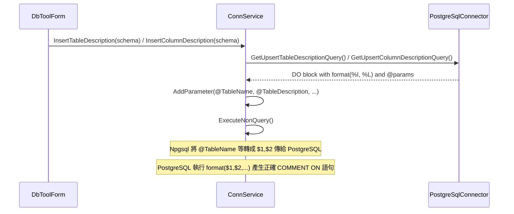

# PostgreSQL 匯入描述 SQL 實作

## 問題說明

目前 [PostgreSqlConnector.cs](DbTool/Service/DbConnector/PostgreSqlConnector.cs) 回傳的範本為：

- `COMMENT ON TABLE @TableName IS @TableDescription`
- `COMMENT ON COLUMN @TableName.@ColumnName IS @ColumnDescription`

在 PostgreSQL 中，`COMMENT ON` 的**物件名稱（table/column）必須是識別符**，不能是綁定參數。若用 Npgsql 把 `@TableName` 當一般參數代入，會變成字串常數，語法錯誤或無效，導致匯入沒效果。

## 解法

使用 **DO 區塊 + `format()` 動態 SQL**，在伺服器端用 `%I`（識別符）與 `%L`（字串常數）安全組出 COMMENT 語句，並仍由 ConnService 傳入 `@TableName`、`@TableDescription`、`@ColumnName`、`@ColumnDescription` 作為參數（Npgsql 會以 $1, $2... 傳給 PostgreSQL）。

## 修改檔案

**檔案：** [DbTool/Service/DbConnector/PostgreSqlConnector.cs](DbTool/Service/DbConnector/PostgreSqlConnector.cs)

### 1. GetUpsertTableDescriptionQuery()（約 129–132 行）

**目前：**

```csharp
return "COMMENT ON TABLE @TableName IS @TableDescription";
```

**改為：**

```csharp
return @"
DO $$
BEGIN
  EXECUTE format('COMMENT ON TABLE %I IS %L', @TableName, @TableDescription);
END $$;";
```

- `%I`：將參數當成識別符（表名）正確引號與跳脫。
- `%L`：將參數當成字串常數（描述）正確跳脫。
- ConnService 仍會對 `@TableName`、`@TableDescription` 呼叫 `AddParameter`，無需改 [ConnService.cs](DbTool/Service/ConnService.cs)。

### 2. GetUpsertColumnDescriptionQuery()（約 134–137 行）

**目前：**

```csharp
return "COMMENT ON COLUMN @TableName.@ColumnName IS @ColumnDescription";
```

**改為：**

```csharp
return @"
DO $$
BEGIN
  EXECUTE format('COMMENT ON COLUMN %I.%I IS %L', @TableName, @ColumnName, @ColumnDescription);
END $$;";
```

- 兩個 `%I` 分別對應表名與欄位名，`%L` 對應描述。
- 參數順序與 ConnService 的 `AddParameter(cmd, "@TableName", ...)`、`AddParameter(cmd, "@ColumnName", ...)`、`AddParameter(cmd, "@ColumnDescription", ...)` 一致。

## 資料流（與 ConnService 的配合）




## 注意事項

- 不需改 [ConnService.cs](DbTool/Service/ConnService.cs)，介面與參數名稱維持不變。
- 若表名/欄位名含雙引號等特殊字元，`format(..., %I)` 會正確引號與跳脫，避免 SQL 注入。

