# DbTool

[toc]

## 用途

僅支援 MS SQL，輸入連線字串之後可進行資料庫規格下載(產置excel檔案)，匯入資料庫欄位描述、資料表描述，與下載 Model.cs 方便開發使用

### 資料庫測試連線

所有功能都需要先測試連線之後才能順利進行

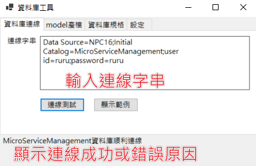

不確定連線字串怎麼輸入可以點選顯示範例參考，或是直接使用範例做連線修改

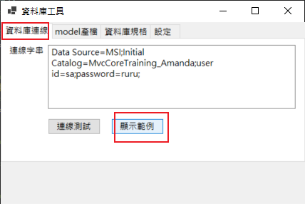

雙擊清空提示訊息

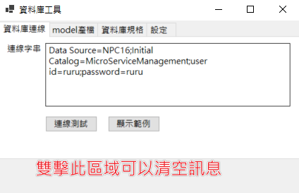

### 資料庫規格下載

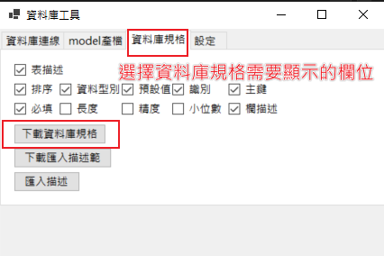

下載後會顯示檔案位置，並且打開下載檔案

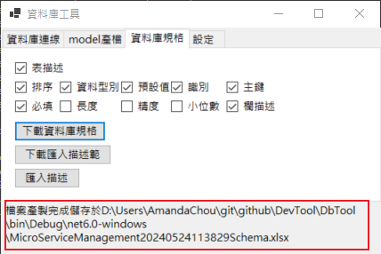

檔案會依照使用者勾選的類別顯示欄位

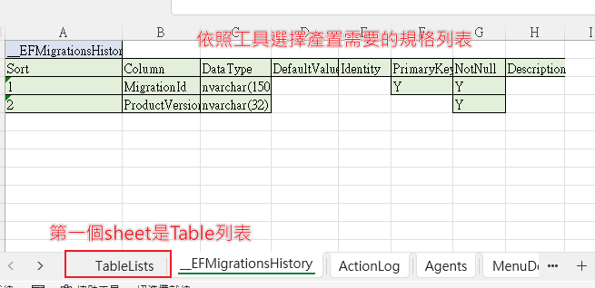

如果資料庫Table有設定描述 Table 列表會有表描述

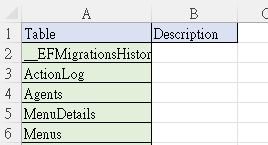

### 資料庫規格匯入欄位描述、表描述

#### 要注意

1. 如果本機已經開啟描述範本檔案，會影響範本下載
2. 描述範本，輸入好後不可修改欄位名、檔案名，才能有效匯入範本

匯入資料庫欄位描述、表描述，必須先下載匯入描述範本

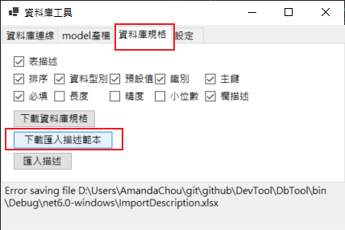

範本內容會只有表名稱、描述名稱，以及欄位名稱、描述名稱的對應excel

要注意如果本機已經開啟描述範本檔案，會影響範本下載

excel輸入好後點選匯入描述，注意檔案不可以改名

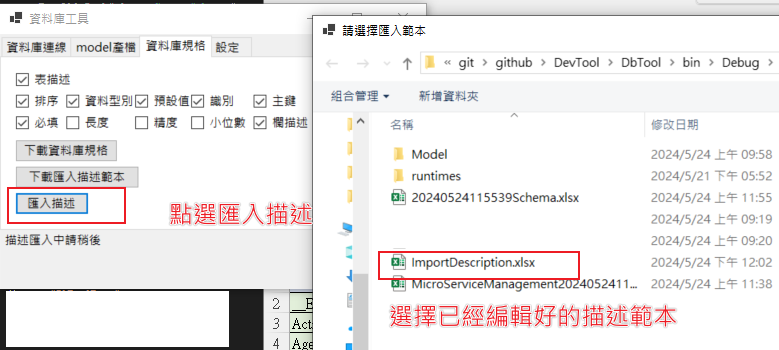

如有成功會提示匯入完成

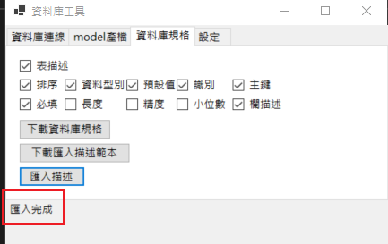

可以再次下載規格或登入資料庫查看是否匯入正確

### Model產檔

點選所有model產檔，會存於工具位置Model資料夾

將會產置所有Table對應的物件.cs檔

如勾選Display、Required 等 annotation

summary 來自欄描述、表描述
display來自表描述、資料長度
key 的顯示會受限於 欄位名稱 是否是TableName+id 或者是 tableName去掉s+id 

### 設定

使用者設定在小工具裡的勾選值或輸入的連線字串

在關掉後再打開，都會保留所有填寫的設定

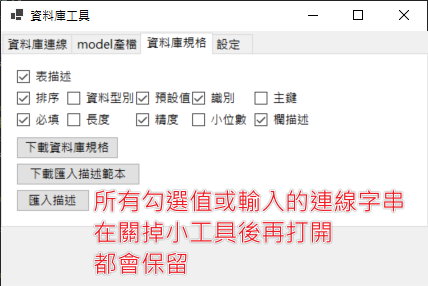

如果想回到初始設定可以點選重置設定

就會回到預設值，僅勾選大部分情況會需要的欄位顯示

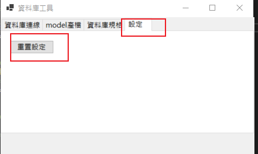