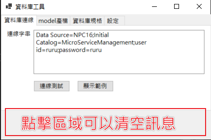

# DbTool

[toc]

## 用途

僅支援 MS SQL，輸入連線字串之後可進行資料庫規格下載(產置excel檔案)，匯入資料庫欄位描述、資料表描述，與下載 Model.cs 方便開發使用

### 資料庫測試連線

所有功能都需要先測試連線之後才能順利進行

### 資料庫規格下載

下載後會顯示檔案位置，並且打開下載檔案

檔案會依照使用者勾選的類別顯示欄位

如果資料庫Table有設定描述 Table 列表會有表描述

### 資料庫規格匯入欄位描述

匯入資料庫欄位描述，必須先下載匯入描述範本